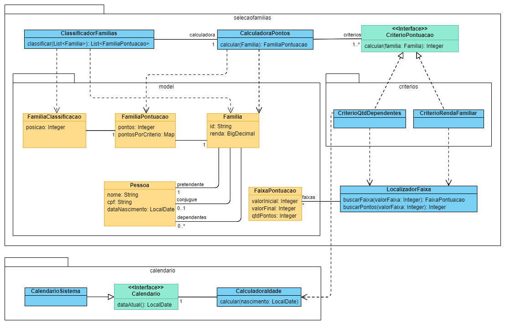

# Seleção de Famílias

## Requisitos

https://www.notion.so/Desafio-t-cnico-2f53347cf16a418fb75c67c978ab1a0e

## Solução Técnica

### Diagrama de Classes


### Tecnologias 
* Java 11 (Linguagem orientada a objetos e multiplataforma)
* Maven (para construir e gerenciar o projeto Java e suas dependencias)
* Lombok (para diminuir a verbosidade da linguagem Java)
* JUnit 5 (para escrever e rodar testes)
* AssertJ (para adicionar assertions fluentes para os testes)
* YAML (para escrever dados de testes)
* Jackson (para carregar conteúdo no formato YAML para objetos Java)

### Passos para compilar a aplicação e rodar os testes

> Observação: Necessário ter o Java 11 ou superior e Maven 3 instalados
```shell
mvn compile
mvn test
```